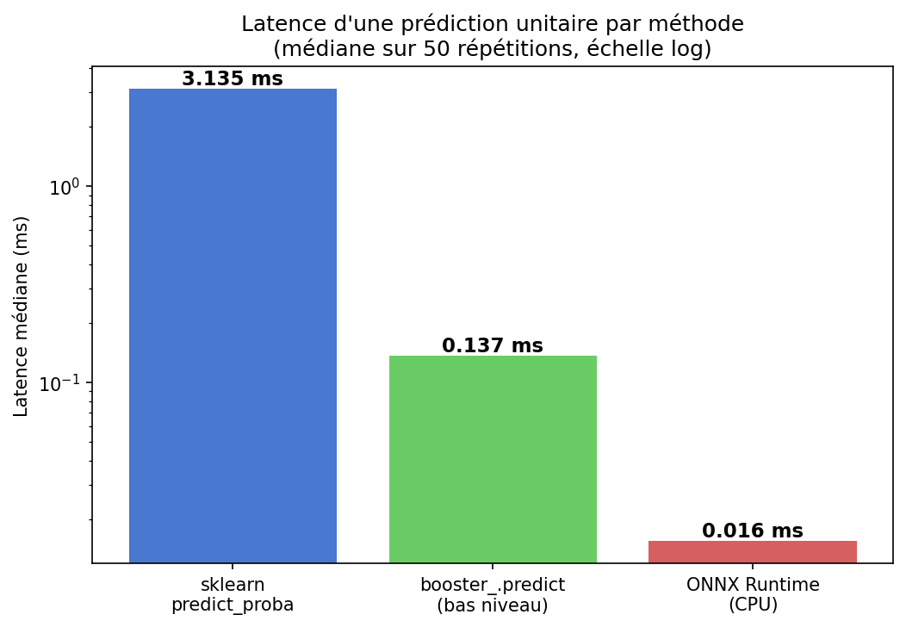
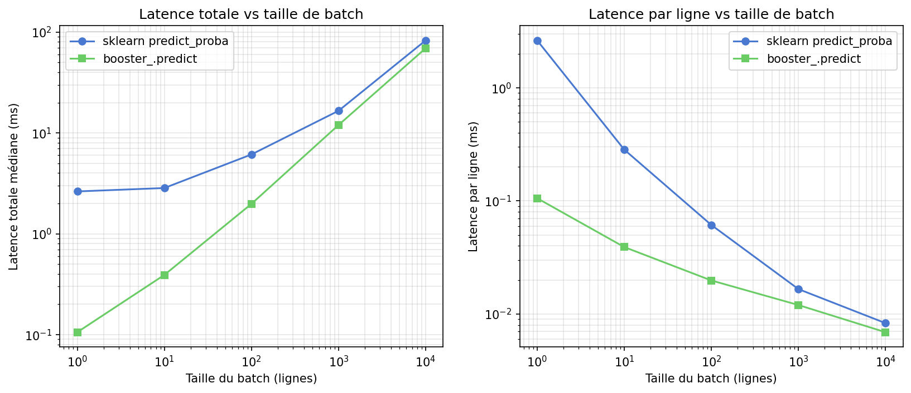

# Rapport d'optimisation des performances d'inférence — « Prêt à dépenser »

**Projet** : MLOps OpenClassrooms — API de scoring crédit (partie 2, étape 4)
**Modèle** : `LGBMClassifier` LightGBM — 800 arbres, 402 features (`models/model.skops`)
**Date des mesures** : 10/09/2026 — tous les chiffres ci-dessous sont issus de
l'exécution réelle de `optimization/profile_inference.py` (résultats bruts dans
`optimization/benchmarks.json`).

---

## 1. Résumé exécutif

| Chemin d'inférence (1 prédiction) | Latence médiane | Gain vs référence sklearn |
|---|---|---|
| Chemin API naïf (dict → DataFrame → coercion → `predict_proba`) | **31,42 ms** | — |
| `predict_proba` sklearn seul (référence) | **3,14 ms** | — |
| `booster_.predict` bas niveau (numpy) | **0,137 ms** | **− 95,6 % (× 23)** |
| **ONNX Runtime CPU** | **0,0156 ms** | **− 99,5 % (× 201)** |
| Chemin API optimisé (dict → numpy float32 → `booster_.predict`) | **0,188 ms** | − 99,4 % vs chemin naïf |

**Stratégie retenue : ONNX Runtime (CPUExecutionProvider) + construction directe
d'un tableau numpy float32 à partir de la requête JSON.** La parité des
probabilités avec le modèle de référence est vérifiée (écart max 2,3 × 10⁻⁷,
0 décision divergente sur 1000 au seuil métier 0,45).

Le vrai goulot d'étranglement n'est **pas le modèle** mais la **plomberie pandas** :
la coercion `DataFrame.apply(pd.to_numeric)` représente **84 %** du temps cumulé
du chemin API profilé.

---

## 2. Contexte et méthodologie

### Machine de mesure

- Windows 11 (10.0.26200), CPU AMD64 — 16 cœurs physiques / 32 logiques, 34 Go de RAM
- Python 3.12.14 — lightgbm 4.7.0, scikit-learn 1.9.0, pandas 3.0.2,
  onnxruntime 1.29.0, onnxmltools 1.16.0

### Protocole

- **Données** : `data/processed/test.parquet` (48 744 lignes × 402 features),
  noms de colonnes normalisés par la même règle que `src/config.py`
  (`[^A-Za-z0-9_]` → `_`), coercion `apply(pd.to_numeric, errors="coerce")`.
- **Métriques** : médiane et p95 sur **50 répétitions** (20 pour le batch
  10 000, 200 pour la décomposition par étape), **10 itérations de warmup**,
  chronométrage `time.perf_counter`.
- **Profiling** : cProfile sur 200 itérations du chemin API complet
  (construction du DataFrame 1 ligne depuis un dict JSON simulé + coercion +
  `predict_proba`).
- **Parité** : écart maximal absolu des probabilités sur 1000 lignes entre
  chaque variante et `predict_proba` sklearn (référence), et comptage des
  décisions divergentes au seuil métier **0,45**.

---

## 3. Goulots d'étranglement identifiés par le profiling

Profiling cProfile du chemin API complet, 200 itérations, temps total 17,66 s
(88,3 ms/appel — la surcharge cProfile gonfle les valeurs absolues, seules les
**proportions** comptent). Détail complet : `optimization/cprofile_report.txt`.

| Fonction | % du temps cumulé |
|---|---|
| `DataFrame.apply` (coercion `to_numeric` colonne par colonne) | **84,0 %** |
| `DataFrame.__init__` (construction depuis le dict, 402 colonnes) | 43,2 % |
| `wrap_results` / reconstruction du DataFrame résultat de `apply` | 33,5 % |
| `pd.to_numeric` (80 400 appels = 402 colonnes × 200 itérations) | inclus dans apply |

*(les pourcentages se chevauchent car ce sont des temps cumulés imbriqués)*

**Conclusion du profiling** : pour une requête unitaire, la quasi-totalité du
temps est dépensée dans pandas (construction d'un DataFrame de 402 colonnes à
partir d'un dictionnaire, puis coercion colonne par colonne), **pas dans
LightGBM**. C'est confirmé par la décomposition chronométrée (médianes sur
200 répétitions) :

| Étape (1 ligne) | Temps médian |
|---|---|
| Construction DataFrame depuis dict + réindexation | 1,830 ms |
| Coercion `apply(pd.to_numeric, errors="coerce")` | 13,095 ms |
| `predict_proba` seul (données déjà prêtes) | 2,364 ms |
| **Chemin API naïf complet** | **31,421 ms** |
| Construction numpy float32 directe depuis dict | 0,053 ms |
| **Chemin optimisé complet (dict → numpy → booster)** | **0,188 ms** |

Remplacer le passage par pandas par une construction numpy directe
(`np.array([[payload.get(c) for c in COLS]], dtype=np.float32)`) divise le
temps de préparation par **~35** (1,83 + 13,10 ≈ 14,9 ms → 0,053 ms).

---

## 4. Tableau comparatif des stratégies testées

### 4.1 Latence d'une prédiction unitaire (médiane / p95, 50 répétitions)

| Stratégie | Médiane | p95 | Parité proba vs sklearn |
|---|---|---|---|
| `predict_proba` sklearn (référence) | 3,135 ms | 3,484 ms | — (référence) |
| `booster_.predict(numpy, raw_score=False)` | 0,137 ms | 0,146 ms | **max\|diff\| = 0,0** (strictement identique) |
| **ONNX Runtime (CPU)** | **0,0156 ms** | **0,0171 ms** | max\|diff\| = 2,3 × 10⁻⁷ (< 10⁻⁴) |

### 4.2 Effet du parallélisme (n_jobs / num_threads)

| Batch | sklearn n_jobs=1 | sklearn n_jobs=-1 | booster threads=1 | booster threads=-1 |
|---|---|---|---|---|
| 1 | 1,517 ms | 3,146 ms | **0,073 ms** | 0,119 ms |
| 100 | 11,794 ms | 4,501 ms | 10,132 ms | **5,436 ms** |
| 1000 | 103,538 ms | 32,495 ms | 101,896 ms | **28,391 ms** |

Enseignements :

- **Sur 1 ligne, le multithreading nuit** (surcharge de synchronisation) :
  `threads=1` est ~1,6× plus rapide que `threads=-1`.
- **Dès 100 lignes, le parallélisme paie** : ~2 à 4× plus rapide avec tous les cœurs.
- Pour une API servant des prédictions **unitaires**, il faut donc fixer
  `num_threads=1` (ou compter sur ONNX, mono-thread par appel et déjà le plus
  rapide).

### 4.3 Latence par taille de batch (médiane totale et par ligne)

| Batch | sklearn total | sklearn/ligne | booster total | booster/ligne |
|---|---|---|---|---|
| 1 | 2,632 ms | 2,632 ms | 0,106 ms | 0,106 ms |
| 10 | 2,845 ms | 0,285 ms | 0,391 ms | 0,039 ms |
| 100 | 6,125 ms | 0,061 ms | 1,982 ms | 0,020 ms |
| 1000 | 16,608 ms | 0,017 ms | 12,006 ms | 0,012 ms |
| 10 000 | 82,897 ms | 0,0083 ms | 69,283 ms | 0,0069 ms |

ONNX sur batch 1000 : **6,269 ms** (p95 7,559 ms), soit ~1,9× plus rapide que
le booster LightGBM et ~2,6× plus rapide que sklearn à cette taille.

Le coût **fixe par appel** de la couche sklearn (~2,6 ms) est amorti dès que le
batch grandit : à 10 000 lignes, sklearn et booster convergent (~0,007–0,008 ms/ligne).
Le gain des chemins optimisés est donc maximal pour le **scoring unitaire en
ligne**, qui est précisément le cas d'usage de l'API.

### 4.4 Empreinte mémoire et taille des artefacts

| Indicateur | Valeur mesurée |
|---|---|
| Fichier `model.skops` | 8,27 Mo |
| Fichier `model.onnx` | **5,63 Mo** (− 32 %) |
| RSS process avant chargement modèle | 632,4 Mo |
| RSS après chargement (skops) | 643,2 Mo |
| **Coût mémoire du modèle chargé** | **+ 10,8 Mo** |

Le modèle tient largement en mémoire pour un déploiement API mono-instance ;
la conversion ONNX réduit en outre l'artefact disque d'un tiers.

---

## 5. Stratégie retenue et justification

**Choix final : modèle converti en ONNX (`optimization/model.onnx`), servi par
`onnxruntime.InferenceSession` (provider `CPUExecutionProvider`), avec
construction directe d'un tableau numpy `float32` (402 colonnes, ordre de
`features.json`) à partir de la requête JSON — sans passer par pandas.**

Justification :

1. **Latence unitaire** : 0,0156 ms vs 3,135 ms pour la référence sklearn
   (**× 201**), et 8,8× plus rapide que le booster LightGBM natif.
2. **Latence batch** : meilleure aussi sur batch 1000 (6,27 ms vs 12,0 ms
   booster, 16,6 ms sklearn).
3. **Parité vérifiée** : écart max 2,3 × 10⁻⁷ sur les probabilités (tolérance
   10⁻⁴), **0 décision divergente sur 1000** au seuil métier 0,45.
4. **Compatibilité FastAPI CPU-only** : `onnxruntime` est une dépendance unique,
   légère, thread-safe pour l'inférence (une `InferenceSession` partagée entre
   requêtes), sans GIL pendant le calcul natif, et sans la dépendance LightGBM
   en production. L'artefact est 32 % plus petit.
5. **Suppression du goulot pandas** : la construction numpy directe coûte
   0,053 ms contre ~15 ms pour le couple DataFrame + coercion.

**Repli (fallback) documenté** : si l'on souhaite rester dans l'écosystème
LightGBM pur (pas de nouvelle dépendance), le chemin « dict → numpy →
`booster_.predict(raw_score=False, num_threads=1)` » à 0,188 ms de bout en bout
reste **× 167** plus rapide que le chemin API naïf, avec des probabilités
strictement identiques à sklearn (max|diff| = 0). C'est la configuration
recommandée en secours, avec `num_threads=1` pour le scoring unitaire et
`num_threads=-1` pour les batches ≥ 100 lignes.

---

## 6. Vérification de non-régression

| Contrôle | Résultat |
|---|---|
| booster vs sklearn — max\|diff\| probas (1000 lignes) | **0,0** (identique bit à bit) |
| ONNX vs sklearn — max\|diff\| probas (1000 lignes) | **2,32 × 10⁻⁷** (< tolérance 10⁻⁴) |
| booster vs sklearn — décisions divergentes au seuil 0,45 | **0 / 1000** |
| ONNX vs sklearn — décisions divergentes au seuil 0,45 | **0 / 1000** |

L'écart résiduel ONNX (~2 × 10⁻⁷) provient du calcul en float32 (vs float64
côté LightGBM) ; il est sans effet sur la décision de crédit au seuil 0,45.

---

## 7. Limites et pistes d'amélioration

- **Mesures mono-machine** (Windows 11, AMD 16 cœurs) : les latences absolues
  varieront sur le serveur cible ; les **rapports** entre stratégies sont en
  revanche robustes. À rejouer sur la machine de production (Linux/Docker).
- **Float32 ONNX** : parité excellente ici, mais un contrôle de parité doit
  être rejoué à chaque reconversion (test automatisé recommandé en CI).
- **Quantification** non testée : les arbres ONNX sont difficilement
  quantifiables ; la piste pertinente serait plutôt la réduction du nombre
  d'arbres (early stopping plus agressif) ou la distillation, au prix d'une
  ré-évaluation métier (coût du faux négatif élevé en scoring crédit).
- **Concurrence API** : les benchmarks sont séquentiels. Sous charge FastAPI
  (uvicorn multi-workers), ONNX Runtime monopolise les threads intra-op ;
  régler `intra_op_num_threads` et le nombre de workers uvicorn selon le CPU
  du conteneur.
- **Batching dynamique** : si le trafic le permet, agréger les requêtes par
  micro-batches (quelques ms de fenêtre) exploite le meilleur coût par ligne
  mesuré (0,007–0,008 ms/ligne à 10 000 lignes).
- **Préprocessing amont** : la coercion `pd.to_numeric` reste nécessaire pour
  les données brutes du parquet ; en production, valider les types à l'entrée
  (schéma Pydantic) supprime définitivement cette étape du chemin chaud.

---

## Annexes — fichiers produits

| Fichier | Contenu |
|---|---|
| `optimization/profile_inference.py` | script complet et rejouable des benchmarks |
| `optimization/cprofile_report.txt` | top 20 cProfile (temps cumulé + propre) et goulots |
| `optimization/benchmarks.json` | tous les chiffres mesurés (médiane, p95, min, max) |
| `optimization/model.onnx` | modèle converti (5,63 Mo, zipmap=False) |
| `optimization/figures/latence_1_ligne.png` | latence unitaire par méthode |
| `optimization/figures/latence_vs_batch.png` | latence totale et par ligne vs taille de batch |
| `optimization/figures/decomposition_1_ligne.png` | décomposition du temps par étape |
